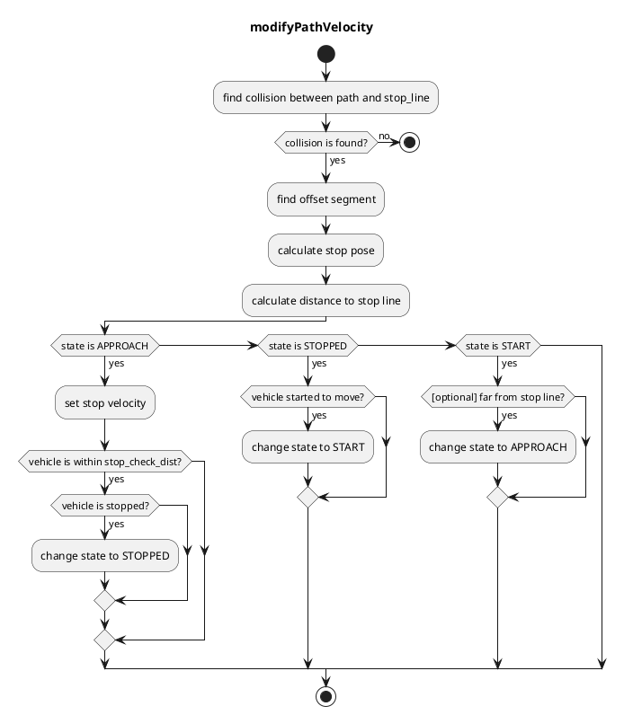
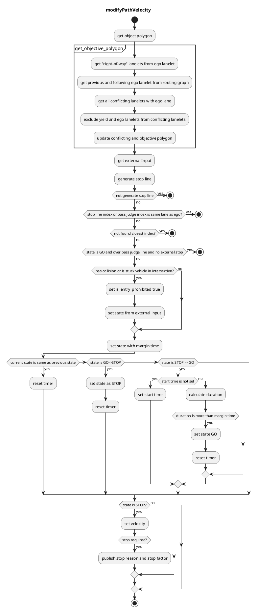
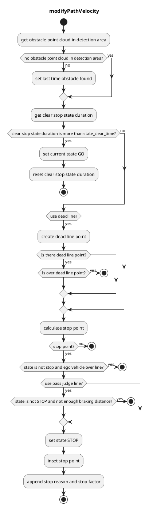
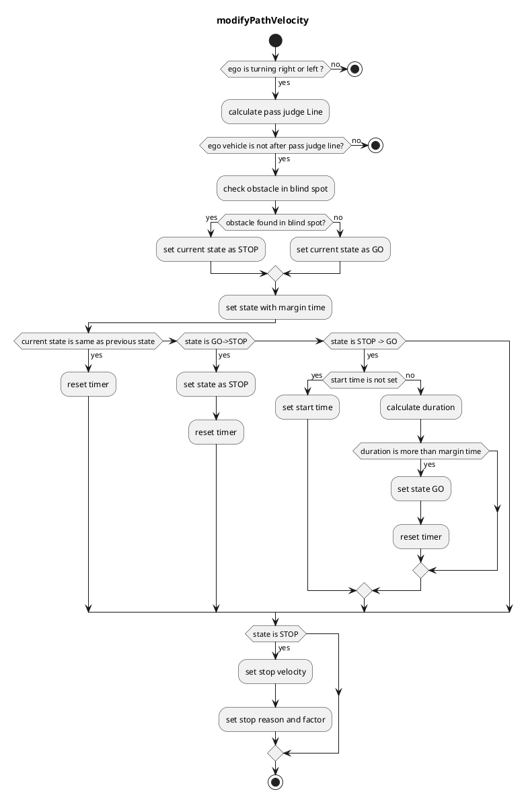

# The `behavior_velocity_planner` Package

## Overview

`behavior_velocity_planner` is a planner that adjust velocity based on the traffic rules. It
consists of several modules.

- Blind Spot
- Crosswalk
- Detection Area
- Intersection
- Stop Line

When each module plans velocity, it considers based on `base_link`(center of rear-wheel axis) pose.
So for example, in order to stop at a stop line with the vehicles' front on the stop line, it
calculates `base_link` position from the distance between `base_link` to front and modifies path
velocity from the `base_link` position.

## Input topics

| Name                                   | Type                                                    | Description                               |
|----------------------------------------|---------------------------------------------------------|-------------------------------------------|
| `HAD_Map_Client`                       | autoware_auto_mapping_msgs::srv::HADMapService          | HAD Map information                       |
| `~/input/path_with_lane_id`            | autoware_auto_planning_msgs::msg::PathWithLaneId        | Path with lane_id                         |
| `~/input/dynamic_objects`              | autoware_auto_perception_msgs::msg::PredictedObjects    | Dynamic objects from perception module    |
| `~/input/vehicle_velocity`             | autoware_auto_vehicle_msgs::msg::VehicleKinematicState  | For ego-velocity                          |
| `~/input/no_ground_pointcloud`         | sensor_msgs::msg::PointCloud2                           | Obstacle pointcloud                       |
| `~/input/external_crosswalk_states`    | autoware_auto_planning_msgs::msg::OrderMovement         | Movement order to follow in crosswalks    |
| `~/input/external_intersection_states` | autoware_auto_planning_msgs::msg::OrderMovement         | Movement order to follow in intersections |

## Output topics

| Name                    | Type                                         | Description                            |
|-------------------------|----------------------------------------------|----------------------------------------|
| `~/output/trajectory`   | autoware_auto_planning_msgs::msg::Trajectory | Trajectory for controller to follow    |
| `~/output/stop_reasons` | diagnostic_msgs::msg::DiagnosticStatus       | Reasons that cause the vehicle to stop |
| `~/debug/path`          | visualization_msgs::msg::MarkerArray         | Path markers for rviz2 to debug        |

## Node parameters

| Parameter               | Type   | Description                                                                         |
| ----------------------- | ------ | ----------------------------------------------------------------------------------- |
| `launch_blind_spot`     | bool   | whether to launch blind_spot module                                                 |
| `launch_crosswalk`      | bool   | whether to launch crosswalk module                                                  |
| `launch_detection_area` | bool   | whether to launch detection_area module                                             |
| `launch_intersection`   | bool   | whether to launch intersection module                                               |
| `launch_traffic_light`  | bool   | whether to launch traffic light module                                              |
| `launch_stop_line`      | bool   | whether to launch stop_line module                                                  |
| `forward_path_length`   | double | forward path length                                                                 |
| `backward_path_length`  | double | backward path length                                                                |
| `max_accel`             | double | (to be a global parameter) max acceleration of the vehicle                          |
| `delay_response_time`   | double | (to be a global parameter) delay time of the vehicle's response to control commands |

## Modules

### Stop Line

#### Role

This module plans velocity so that the vehicle can stop right before stop lines and restart driving
after stopped.

#### Module Parameters

| Parameter         | Type   | Description                                                                                    |
| ----------------- | ------ | ---------------------------------------------------------------------------------------------- |
| `stop_margin`     | double | a margin that the vehicle tries to stop before stop_line                                       |
| `stop_check_dist` | double | when the vehicle is within `stop_check_dist` from stop_line and stopped, move to STOPPED state |

#### Flowchart

This algorithm is based on `segment`.
`segment` consists of two node points. It's useful for removing boundary conditions because
if `segment(i)` exists we can assume `node(i)` and `node(i+1)` exist.

First, this algorithm finds a collision between reference path and stop line. Then, we can
get `collision segment` and `collision point`.

Next, based on `collision point`, it finds `offset segment` by iterating backward points up to a
specific offset length. The offset length is `stop_margin`(parameter) + `base_link to front`(to
adjust head pose to stop line). Then, we can get `offset segment` and `offset from segment start`.

After that, we can calculate a offset point from `offset segment` and `offset`. This will
be `stop_pose`.

### Intersection

#### Role

Judgement whether a vehicle can go into an intersection or not by a dynamic object information, and
planning a velocity of the start/stop

#### Launch Timing

Launches when there is an intersection area on a target lane

#### Module Parameters

| Parameter                                     | Type   | Description                                                                   |
| --------------------------------------------- | ------ | ----------------------------------------------------------------------------- |
| `intersection/state_transit_margin_time`      | double | [s] time margin to change state                                               |
| `intersection/decel_velocity`                 | double | [m/s] deceleration velocity in intersection                                   |
| `intersection/path_expand_width`              | double | [m] path area to see with expansion                                           | 
| `intersection/stop_line_margin`               | double | [m] margin before stop line                                                   |
| `intersection/stuck_vehicle_detect_dist`      | double | [m] this should be the length between cars when they are stopped.             |
| `intersection/stuck_vehicle_ignore_dist`      | double | [m] obstacle stop max distance(5.0m) + stuck vehicle size / 2 (0.0m-)         |
| `intersection/stuck_vehicle_vel_thr`          | double | [m/s] velocity below 3[km/h] is ignored by default                            |
| `intersection/intersection_velocity`          | double | [m/s] velocity to pass intersection. 10[km/h] is by default                   |
| `intersection/intersection_max_accel`         | double | [m/s^2] acceleration in intersection                                          |
| `intersection/detection_area_length`          | double | [m] range for lidar detection 200m is by default                              |

#### Flowchart

NOTE current state is treated as `STOP` if `is_entry_prohibited` = `true` else `GO`

### CrossWalk

#### Role

Judgement whether a vehicle can go into a crosswalk and plan a velocity of the start/stop.

#### Launch Timing

Launches when there is a crosswalk on the target lane.

#### Module Parameters

| Parameter                                              | Type   | Description                                                              |
| ------------------------------------------------------ | ------ | ------------------------------------------------------------------------ |
| `crosswalk/stop_line_distance`                         | double | [m] make stop line away from crosswalk when no explicit stop line exists |
| `crosswalk/stop_margin`                                | double | [m] a margin that the vehicle tries to stop before stop_line             |
| `crosswalk/slow_margin`                                | bool   | [m] a margin that the vehicle tries to slow down before stop_line        |
| `crosswalk/slow_velocity`                              | double | [m/s] a slow down velocity                                               |
| `crosswalk/stop_dynamic_object_prediction_time_margin` | double | [s] time margin for decision of ego vehicle to stop or not               |
| `walkway/stop_line_distance`                           | double | [m] make stop line away from crosswalk when no explicit stop line exists |
| `walkway/stop_margin`                                  | double | [m] a margin that the vehicle tries to stop before walkway               |

#### Flowchart

flow chart is almost the same as stop line.

### Detection Area

#### Role

If pointcloud is detected in a detection area defined on a map, the stop planning will be executed
at the predetermined point.

#### Launch Timing

Launches if there is a detection area on the target lane.

### Algorithm

1. Gets a detection area and stop line from map information and confirms if there is pointcloud in
   the detection area
2. Inserts stop point l[m] in front of the stop line
3. Inserts a pass judge point to a point where the vehicle can stop with a max deceleration
4. Sets velocity as zero behind the stop line when the ego-vehicle is in front of the pass judge
   point
5. If the ego vehicle has passed the pass judge point already, it doesn’t stop and pass through.

#### Module Parameters

| Parameter             | Type   | Description                                                                                        |
| --------------------- | ------ | -------------------------------------------------------------------------------------------------- |
| `stop_margin`         | double | [m] a margin that the vehicle tries to stop before stop_line                                       |
| `use_dead_line`       | bool   | [-] weather to use dead line or not                                                                |
| `dead_line_margin`    | double | [m] ignore threshold that vehicle behind is collide with ego vehicle or not                        |
| `use_pass_judge_line` | bool   | [-] weather to use pass judge line or not                                                          |
| `state_clear_time`    | double | [s] when the vehicle is stopping for certain time without incoming obstacle, move to STOPPED state |

#### Flowchart

### Blind Spot

#### Role

Blind spot check while turning right/left by a dynamic object information, and planning and planning
of a velocity of the start/stop.

### Definition

Sets a stop line, a pass judge line, a detection area and conflict area based on a map information
and a self position.

- Stop line : Automatically created based on crossing lane information.

- Pass judge line : A position to judge if stop or not to avoid a rapid brake.

- Detection area : Right/left side area of the self position.

- Conflict area : Right/left side area from the self position to the stop line.

#### Module Parameters

| Parameter                       | Type   | Description                                                                 |
| ------------------------------- | ------ | --------------------------------------------------------------------------- |
| `stop_line_margin`              | double | [m] a margin that the vehicle tries to stop before stop_line                |
| `backward_length`               | double | [m] distance from closest path point to the edge of beginning point.        |
| `ignore_width_from_center_line` | double | [m] ignore threshold that vehicle behind is collide with ego vehicle or not |
| `max_future_movement_time`      | double | [s] maximum time for considering future movement of object                  |

#### Flowchart

